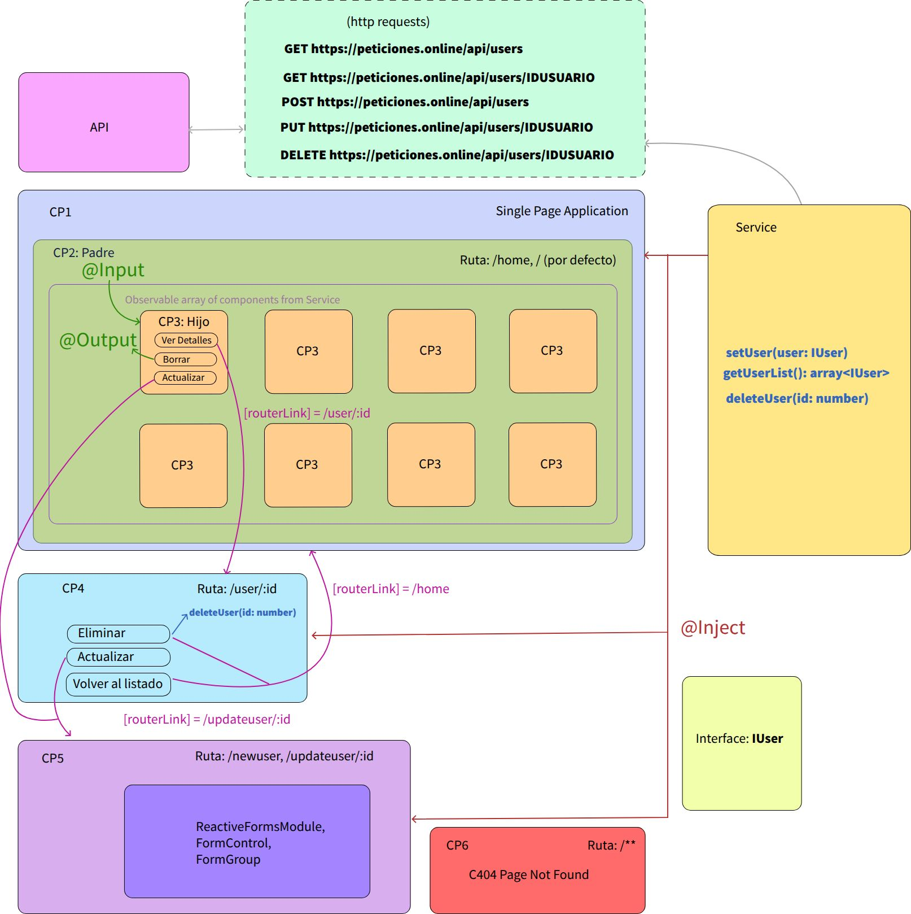
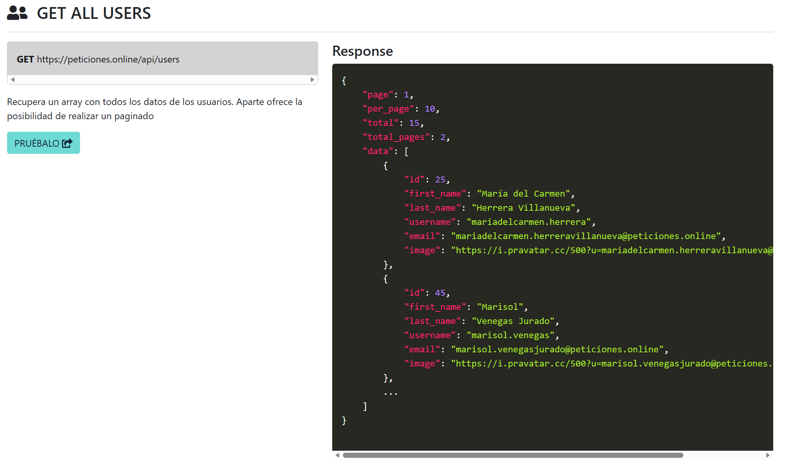

# UNIR_FULLSTACKDEVELOPER_ACTIVIDAD_6
Módulo 3. Framework de Front End Angular - Actividad 6: Aplicación consultando a API Externa

## 1. Creación Del Proyecto
Comando para crear un proyecto en Angular:
```bash
ng new UserProfile
```

### 1.1 Diseño Arquitectura Proyecto
Antes de empezar con las distintas prácticas del proyecto, he hecho un diseño de la arquitectura de sistema. Se han identificado:
    
* Diseño de Componentes: 
    * Componentes relacionados padre/hijo
    * Componentes no relacionados
* Identificación de entradas y salidas de datos entre    componentes relacionados(@Inputs y @Outputs).
* Identificación de entrada y salida de datos entre    componentes no relacionados(@Injectable).
* Diseño del Servicio para la comunicación entre los componentes no relacionados
* Diseño del Servicio para la peticiones a una API.
* Diseño de interfaz de datos.
* Diseño del sistema de rutas para cada componente
* Diseño del Formulario y Validaciones



## 2. Creación De Rutas Y Componentes.

### 2.1 Rutas
Se han definido las siguientes rutas:

**/home:** donde ser cargará el listado de usuarios completo.

**/user/1:** donde ser cargará la vista de usuario con todos sus datos. Nótese que el numero de la ruta corresponde al id del usuario.

**/newuser:** donde ser cargará un formulario que dará de alta un usuario siguiendo el patron del api de creater user.

**/updateuser/1:** se cargará reutilizando el formulario de registro los datos del usuario a actualizar para que se pueda actualizar los datos y mandárselos al api.

### 2.2 Componentes.
He definido hasta 6 tipos de componentes teniendo en cuenta la aplicación principal.

Componentes:

* CP1 -> **App** componente de aplicación principal.
* CP2 -> **Home** Componente home que contendrá el grid de componentes Caption.
* CP3 -> **Caption** Componente para la generación de los Captions.
* CP4 -> **Profile** Componente para la visualización del perfil de cada usuario.
* CP5 -> **Formulary** fomrulario de contacto para crear o modificar los usuarios.
* CP6 -> **C404** Para mostrar error cuando la página no se encuentra.

Estos se han creado mediante los siguientes comandos:

```bash
ng generate component components/home --skip-tests
ng generate component components/caption --skip-tests
ng generate component components/profile --skip-tests
ng generate component components/formulary --skip-tests
ng generate component components/c404 --skip-tests
```

## 3. Creación De Las Interfaces y Servicios Para Conectar A Una API.
Para esta  actividad se usará una página que simula una API: https://peticiones.online/users

### 3.1 Interfaces
Las interfaces definen el diseño del modelo de datos que necesitamos para nuestra aplicación. Son un contrato que define
que tipo de datos debe tener nuestro objeto. 



En nuestro caso, de la siguiente imagen, podemos identificar dos tipos de objetos JSON que coresponden a dos partes interdependientes, pero con informaciones distintas; estas son:
* Objeto con la información de los datos de la página. 
* Objeto con la información de los datos de un usuario.

De aquí podemos generar dos interfaces:

* Interfaz Página Usuarios --> IPage
* Interfaz Usuario         --> IUser  

Estos se han creado mediante los siguientes comandos:

```bash
ng generate interface interfaces/ipage
ng generate interface interfaces/iuser
```

### 3.2 Servicios
En el diseño de arquitectura de sistema, se ha identificado la necesidad de un Servicio. Este cumplirá las siguientes funciones:
* Comunicarse con la API, para obtener, elminiar, poner y modificar los datos del servidor remoto
  a través de peticiones HTTP.
* Proporcionar los datos y métodos necesarios a las componentes.

El servicio se ha creado mediante el siguiente comandos:

```bash
ng generate service services/service
```


## 4. Diseño Componente Home
En este componente se mostrará una rejilla (grid) hecha con bootstrap de los usuraios que nos proporciona la API.
Mediante el componente Servicio ejecutaremos los métodos de obtención de usuarios para mostrar los usuarios en cada página. 

Se ha implementado un signal en el componente Home:

```ts
current_page: WritableSignal<number> = signal<number>(this.NO_PAGE); 
```
 
Este signal nos permite regenerar la tabla de usuarios según la página que se le ha indicado a través de los eventos de los botones del footer.

Cada vez vez que haya un cambio (eliminación, creación o modificación de usuarios).

Como la API es un mockup (prueba). Se ha generado la petición para poder eliminar un usuario y se valida que la respuesta ha funcionado correctamente.
Para tener un feedback en la práctica elimino localmente el componente del grid, de esta forma se puede validar la reorganicación de las cartas cuando una desaparece.

## Bootsrap
Antes de empezar con la maquetación usaremos el framework Boostrap para facilitar el diseño de la del sitio web.

Instalaraemos Boostrap con el siguiente comando:
```bash
npm i bootstrap@5.3.8
```

Una vez instalado mediante el node package manager, tenemos que añadir en **angular.json**, la ruta de la hojaa de esitlos y el fichero de javascript para poder utilizarlo en nuestro proyecto.

```json
"styles": [
    "src/styles.css",
    "node_modules/bootstrap/dist/css/bootstrap.min.css"
],
"scripts": [
    "node_modules/bootstrap/dist/css/bootstrap.min.js"
]
``` 

